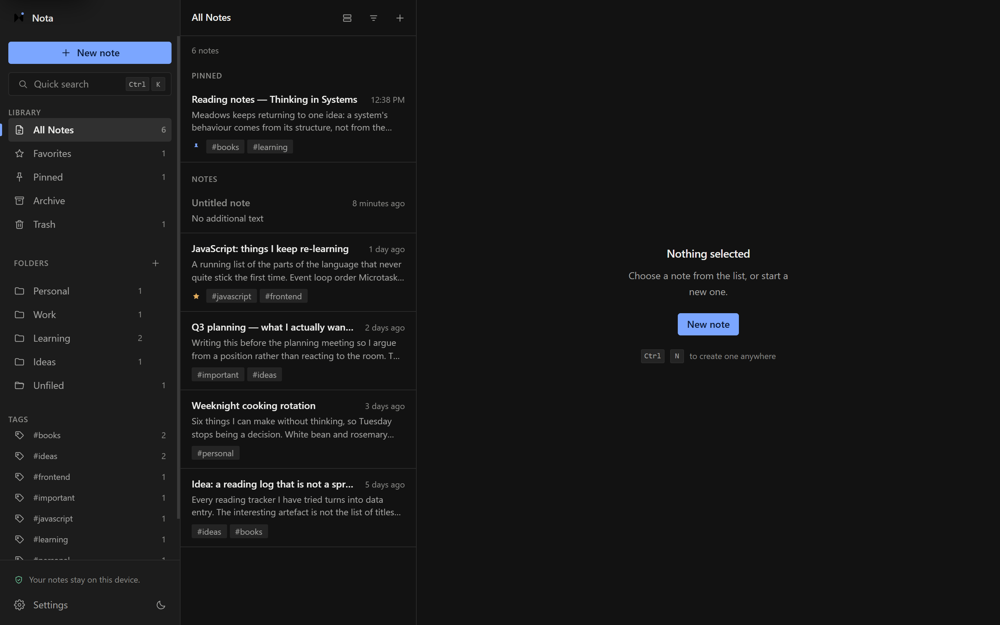
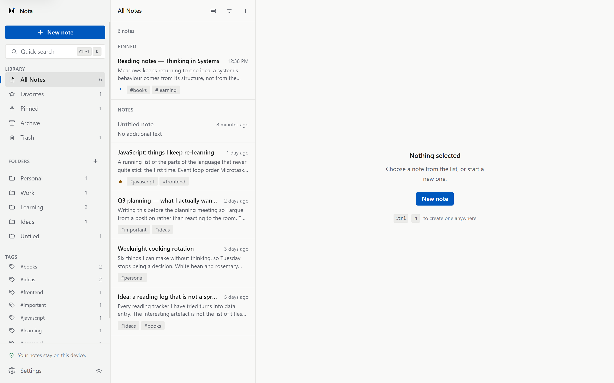
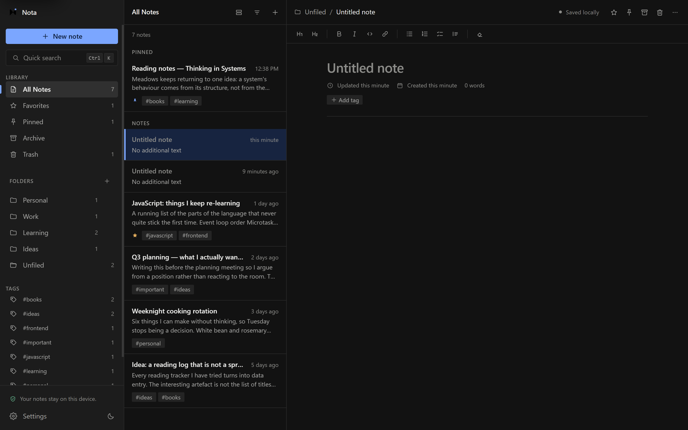
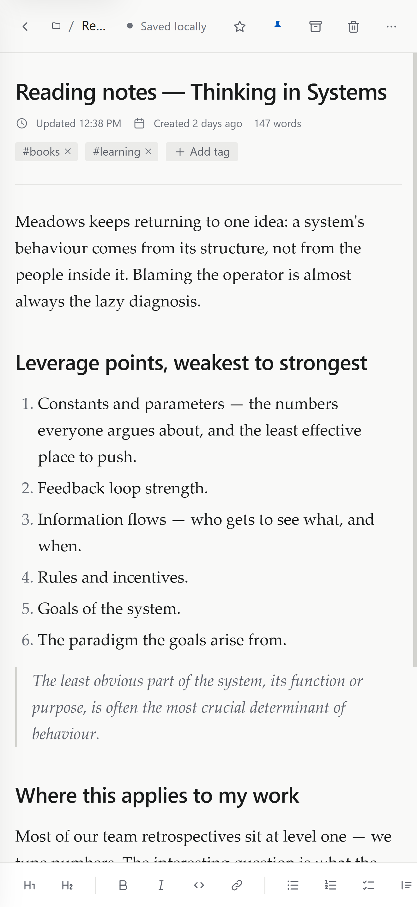

# Nota

**A private, local-first workspace for notes, ideas, tasks, and personal knowledge.**

Nota is a responsive note-taking workspace built around one simple idea:

**your notes should stay yours.**

Everything you write is stored locally in your browser. There is no account, no cloud sync, no analytics, and no backend.

Built with **HTML, CSS, and Vanilla JavaScript ES modules**.

No framework.  
No UI library.  
No CSS framework.  
No build step.

---

## Live Demo

### [Open Nota Workspace](https://allahverdi-dev.github.io/nota-workspace/)

> Nota is local-first. Notes created in the live demo are stored only in your browser on your device.

---

## Preview

### All Notes — Light



### All Notes — Dark



### Writing Experience



### Mobile

<p align="center">
  
</p>

---

## Features

### Writing

- Rich-text note editor
- Headings
- Bold and italic text
- Inline code
- Links
- Bulleted lists
- Numbered lists
- Checklists
- Quotes
- Debounced autosave
- Saving status:
  - Saving...
  - Saved locally
  - Save failed
- Word count
- Created and updated timestamps
- Breadcrumb navigation
- Editor font-size settings
- Line-height settings
- Spell-check preference

### Organisation

- Create, rename, and delete folders
- Default folders:
  - Personal
  - Work
  - Learning
  - Ideas
- Notes from deleted folders automatically move to **Unfiled**
- Tags
- Filter notes by tags
- Favourite notes
- Pin notes
- Archive notes
- Drag notes into folders
- List and grid layouts
- Sorting by:
  - Last updated
  - Date created
  - Title

### Search

- Global search
- Search note titles
- Search note content
- Search folders
- Search tags
- Highlighted matches
- Grouped search results
- Safe substring-based matching without raw RegExp construction

### Command Palette

Open the command palette with:

```text
Ctrl / Cmd + K
```

Use it to:

- create a new note
- navigate between views
- open folders
- jump directly to notes
- access common application actions

The palette supports keyboard navigation with arrow keys, Enter, and Escape.

### Trash and Recovery

- Soft-delete notes
- Restore deleted notes
- Permanently delete notes
- Empty trash
- Confirmation dialogs for destructive actions
- Undo toast after moving a note to trash

### Import and Export

- Export workspace data as JSON
- Import previously exported Nota backups
- Import validation before data is applied
- Hostile or malformed imports are rejected
- Import replaces the current workspace only after confirmation

### Appearance

- Light theme
- Dark theme
- System theme
- Theme preference persistence
- Responsive typography
- Reduced-motion support

### Languages

Nota currently supports:

- English
- Azerbaijani

The interface can be switched without reloading the application.

---

## Local-First by Design

Nota does not require an account or backend.

Notes are stored using:

1. **IndexedDB**
2. **localStorage fallback**
3. **in-memory fallback**

IndexedDB is the preferred storage layer because it is asynchronous and better suited to larger amounts of structured data.

If IndexedDB is unavailable, Nota automatically falls back instead of failing completely.

The active storage driver can be inspected from Settings.

---

## Privacy

**Your notes stay on your device.**

Nota does not include:

- user accounts
- cloud storage
- analytics
- advertising trackers
- telemetry
- remote databases
- third-party icon requests
- remote font requests

The application uses system font stacks instead of downloading web fonts.

Icons are provided through an inline SVG sprite.

### Important

Because Nota is local-first:

- clearing browser storage can remove your notes
- notes do not automatically sync between devices
- exporting backups is recommended for important data

---

## Architecture

Nota uses a modular Vanilla JavaScript architecture.

```text
User interaction
      │
      ▼
┌───────────────┐
│     Views     │
│               │
│ sidebar       │
│ note list     │
│ settings      │
│ onboarding    │
└───────┬───────┘
        │
        ▼
┌───────────────┐
│ Domain Logic  │
│               │
│ notes         │
│ folders       │
│ tags          │
│ search        │
└───────┬───────┘
        │
        ▼
┌───────────────┐
│     Store     │
│               │
│ single state  │
│ tree          │
└───────┬───────┘
        │
   ┌────┼─────────────┐
   ▼    ▼             ▼
 Views  Persistence   Router
        IndexedDB
```

State flows in one direction.

Views do not mutate application state directly.

Instead, they call domain functions that update the central store. Subscribers are then notified about the state slices that changed.

Multiple updates from a single user action are microtask-batched to reduce unnecessary rendering.

---

## Project Structure

```text
nota-workspace/
│
├── index.html
├── README.md
├── LICENSE
├── .gitignore
│
├── assets/
│   └── brand/
│       ├── favicon.svg
│       ├── icon.svg
│       └── wordmark.svg
│
├── css/
│   ├── tokens.css
│   ├── reset.css
│   ├── base.css
│   ├── layout.css
│   ├── components.css
│   ├── editor.css
│   ├── views.css
│   ├── utilities.css
│   └── responsive.css
│
├── js/
│   ├── app.js
│   ├── config.js
│   ├── store.js
│   ├── storage.js
│   ├── sanitize.js
│   ├── router.js
│   ├── notes.js
│   ├── folders.js
│   ├── tags.js
│   ├── editor.js
│   ├── editor-format.js
│   ├── search.js
│   ├── commands.js
│   ├── import-export.js
│   ├── ui.js
│   ├── i18n.js
│   ├── utils.js
│   │
│   └── views/
│       ├── sidebar.js
│       ├── note-list.js
│       ├── settings.js
│       └── onboarding.js
│
├── docs/
│   └── screenshots/
│       ├── all-notes-light.png
│       ├── all-notes-dark.png
│       ├── editor-dark.png
│       └── mobile-notes-light.png
│
├── tests/
│   ├── index.html
│   ├── runner.js
│   └── suite.js
│
└── tools/
    └── serve.mjs
```

---

## Storage and Data Validation

Data loaded from browser storage is treated as untrusted input.

Before reaching application state, stored data is validated and normalised.

The application can recover from:

- malformed notes
- invalid flags
- duplicate IDs
- invalid timestamps
- references to missing folders
- corrupt storage values
- unsupported content
- invalid imports

Rich-text note content is sanitised again when restored.

### Storage Strategy

Notes are stored in **IndexedDB**, with automatic fallback to **localStorage**, and finally to an in-memory store if persistent browser storage is unavailable.

IndexedDB is the preferred storage layer because:

- it is asynchronous
- larger workspaces do not block the main thread during saves
- it offers considerably more space than localStorage
- it is well suited to structured application data

The active theme preference is also mirrored to localStorage so Nota can apply the correct theme before the main JavaScript modules finish loading.

---

## Security

Rich-text editors must treat stored and pasted HTML carefully.

Nota uses a central sanitisation boundary in:

```text
js/sanitize.js
```

The application rebuilds allowed content from a restricted element and attribute list.

Untrusted sources include:

- pasted content
- browser-generated `contenteditable` HTML
- imported backups
- restored browser-storage content

### Link Validation

Only safe protocols are allowed:

- `http:`
- `https:`
- `mailto:`

Protocols such as these are rejected:

- `javascript:`
- `data:`
- `blob:`

Accepted links receive:

```html
rel="noopener noreferrer nofollow"
```

### Additional Protections

Nota avoids:

- `eval`
- `Function` constructors
- inline event handlers
- raw imported HTML
- user-generated RegExp patterns

Search matching uses safe folded substring comparisons rather than constructing regular expressions directly from user input.

`innerHTML` usage is restricted to the sanitisation boundary.

---

## Keyboard Shortcuts

| Shortcut | Action |
| --- | --- |
| `Ctrl / Cmd + K` | Open command palette |
| `Ctrl / Cmd + N` | Create new note |
| `Ctrl / Cmd + S` | Save pending editor changes |
| `/` | Focus search when not typing |
| `Escape` | Close the active overlay |
| `↑ / ↓` | Navigate notes or command results |
| `Enter` | Open selected command result |

Inside the editor:

| Shortcut | Action |
| --- | --- |
| `Ctrl / Cmd + B` | Bold |
| `Ctrl / Cmd + I` | Italic |
| `Ctrl / Cmd + E` | Inline code |
| `Ctrl / Cmd + K` | Link |

---

## Responsive Design

Nota uses different layouts depending on available width.

| Width | Layout |
| --- | --- |
| `> 1080px` | Three panes |
| `761px – 1080px` | Two panes + overlay sidebar |
| `≤ 760px` | Single-pane mobile navigation |

### Desktop

The desktop application uses:

```text
Sidebar → Notes List → Editor
```

### Tablet

The sidebar becomes an overlay while the notes list and editor remain available.

### Mobile

Mobile is not simply a scaled-down desktop interface.

It uses a dedicated flow:

```text
Notes List → Note Editor
```

The formatting toolbar moves to the bottom of the viewport for easier touch access.

Touch targets, safe-area insets, list density, and navigation are adapted for smaller screens.

The application was checked at:

- 1440px
- 1280px
- 1024px
- 768px
- 430px
- 390px
- 360px

---

## Accessibility

Accessibility was considered throughout the interface.

Implemented features include:

- semantic HTML structure
- real buttons and navigation elements
- accessible names for icon-only controls
- decorative SVGs hidden from assistive technology
- visible `:focus-visible` states
- keyboard-accessible application controls
- focus trapping in modal dialogs
- focus restoration after modal close
- Escape-to-close behaviour
- live regions for important status updates
- keyboard navigation in the command palette
- `aria-activedescendant`
- safer destructive-confirmation focus behaviour
- `prefers-reduced-motion`
- contrast targeting WCAG AA

Destructive confirmation dialogs initially focus the safer action rather than the destructive one.

No formal accessibility conformance claim is made.

---

## Running Locally

Nota uses ES modules, so it should be served through HTTP rather than opened directly using `file://`.

Clone the repository:

```bash
git clone https://github.com/allahverdi-dev/nota-workspace.git
```

Enter the project:

```bash
cd nota-workspace
```

Run the included static server:

```bash
node tools/serve.mjs
```

Then open:

```text
http://localhost:4173
```

No installation step is required.

There is no:

```text
npm install
```

There is no build command or generated output directory.

---

## Testing

Start the included development server:

```bash
node tools/serve.mjs
```

Then open:

```text
http://localhost:4173/tests/
```

The project currently includes **59 automated browser checks**.

The automated suite covers areas such as:

- sanitisation
- link security
- note validation
- storage validation
- tag normalisation
- routing
- filtering
- sorting
- search
- highlighting
- timing utilities

Additional testing was performed for:

- onboarding
- note creation
- editing
- autosave
- persistence
- folders
- duplicate folder validation
- tags
- favourites
- pinning
- archive
- trash
- undo
- permanent deletion
- search
- command palette
- keyboard navigation
- keyboard shortcuts
- theme switching
- language switching
- JSON export
- JSON import
- hostile import rejection
- corrupt storage recovery
- responsive layouts
- long note titles
- long tags
- larger note lists

---

## Technology

### Core

- HTML5
- CSS3
- Vanilla JavaScript
- JavaScript ES Modules

### Browser APIs

- IndexedDB
- localStorage
- DOMParser
- Hash routing
- File APIs
- browser editing APIs

### Development and Deployment

- Git
- GitHub
- GitHub Pages

### What Nota Does Not Use

- React
- Vue
- Angular
- Tailwind CSS
- Bootstrap
- jQuery
- TypeScript
- backend frameworks
- npm dependencies
- build tooling

---

## Deployment

Nota is deployed using **GitHub Pages**.

### [Live Demo](https://allahverdi-dev.github.io/nota-workspace/)

Because Nota is a static application, the repository can also be deployed directly to services such as:

- Cloudflare Pages
- Netlify
- Vercel
- GitHub Pages

No build command or output directory is required.

---

## Known Limitations

### No Cloud Sync

Nota currently works on one browser/device at a time.

This is intentional for the current local-first version.

### Browser Storage

Clearing browser data can remove locally stored notes.

Export important work regularly.

### Flat Folders

Nested folders are not currently supported.

### Editor

Formatting is intentionally limited.

Nota currently does not include:

- images
- tables
- advanced nested blocks
- syntax-highlighted code blocks
- custom note version history

### Search

Search currently uses linear matching.

This is suitable for a personal workspace but would eventually need indexing for very large collections.

### Rich-Text API

Some formatting functionality currently relies on `document.execCommand`.

This API is deprecated, but it remains broadly supported in current browsers and is isolated inside the editor-formatting layer so it can be replaced later.

### PWA

Nota currently does not register a service worker and is not installable as a Progressive Web App.

---

## Possible Future Improvements

Potential next steps include:

- PWA support
- service worker
- installable desktop/mobile experience
- `[[wiki-style]]` note links
- backlinks
- full-text search index
- note version history
- nested folders
- merge-on-import
- encrypted exports
- optional end-to-end encrypted sync

---

## AI-Assisted Development

Nota was created using an **AI-assisted / vibe-coding workflow**.

I want to be transparent about that rather than imply that every part of the project was written manually from memory.

### Tools Used

- **ChatGPT** — product planning, feature definition, architecture discussions, QA direction, debugging strategy, and iteration
- **Google Stitch** — initial visual direction and interface exploration
- **Claude Code** — implementation, refactoring, debugging, testing, and visual polish

### My Role

My role in the project included:

- choosing the product direction
- defining the feature set
- deciding how the application should behave
- directing the visual style
- evaluating design concepts
- writing and refining implementation prompts
- reviewing implementation results
- testing the application
- identifying UX problems
- reviewing desktop and mobile layouts
- requesting fixes and improvements
- validating final behaviour
- managing the GitHub repository
- deploying the application
- using the project as part of my ongoing HTML, CSS, and JavaScript learning process

AI tools were used as implementation partners, while product decisions, evaluation, testing, debugging direction, and iteration were actively directed by me.

---

## Project Goals

Nota was built to practice and explore:

- larger Vanilla JavaScript application architecture
- modular JavaScript
- state management
- browser storage
- DOM manipulation
- responsive design
- accessibility
- application security
- local-first product design
- keyboard-driven UX
- testing
- product iteration
- Git and GitHub workflows
- AI-assisted software development workflows

---

## License

This project is available under the terms of the included [LICENSE](LICENSE) file.

---

## Author

**Allahverdi Hasanov**

Vibe Coder / AI-Assisted Builder

[GitHub Profile](https://github.com/allahverdi-dev)

---

<p align="center">
  <strong>Nota</strong><br>
  A private workspace for thoughts that stay yours.
</p>